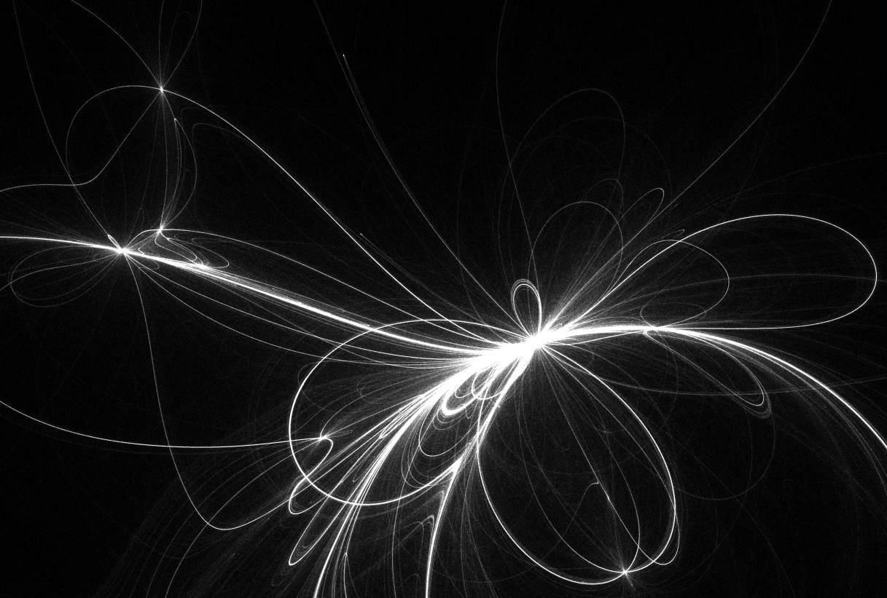

# gravity-shader

This is an alternative take on https://github.com/jakobmollas/gravity-p5 using shaders for both computation and rendering. Using GLSL ES 3 with no external dependencies. This version uses two different calculations, chosen at random, resulting in a bit more varied output.

For some reason I really like those patterns, the basic math is so simple, yet the result is extremely varied and elaborate. It may classified as an IFS (Iterated Function System) fractal but I do not know enough about those.

Writing WebGL code with no extra libraries is not really feasible for anything more than simple prototypes since it is very chatty. It is also very easy to get something wrong, resulting in a blank screen or jumbled output. However, I wanted to understand low level WebGL/GLSL programming so in this case it made sense for me.

- Positions are calculated using vertex shaders, rendered using fragment shaders
- Click to refresh simulation with new values
- Sometimes particles gets stuck, resulting in scattered white pixels, refresh entire page to get rid of that

Live: https://jakobmollas.github.io/gravity-shader/

